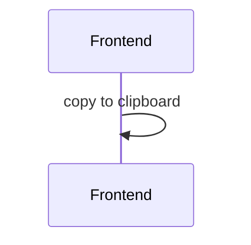

# 1289: Copiar a clipboard numero de folio de compra
A mi parecer, esta historia es exclusivamente Frontend pues no creo que haya necesidad de registrar información en la base de datos sobre si se copia o no el código. Por lo mismo no hay endpoints involucrados ni tampoco habría cambios en la base de datos. El unico endpoint involucrado sería el que está definido en SBOLF-1288 y SBOLF-591 y de ellos se extraería el código de compra que estaríamos copiando. En esas historias se definirá como se define el código de compra y como se codifica el Código QR. Este sería el sequence diagram propuesto para copiar el código.  

## Entry points
- Vista de detalles de QR code (código de compra visible)
- Vista de linea de compra con movimientos (codígo de compra visible)

## Activity

## Endpoints
> N/A

## ER Diagram
> N/A

## Questions
> N/A