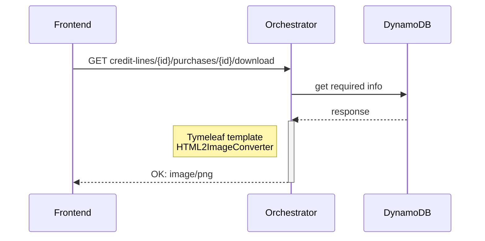
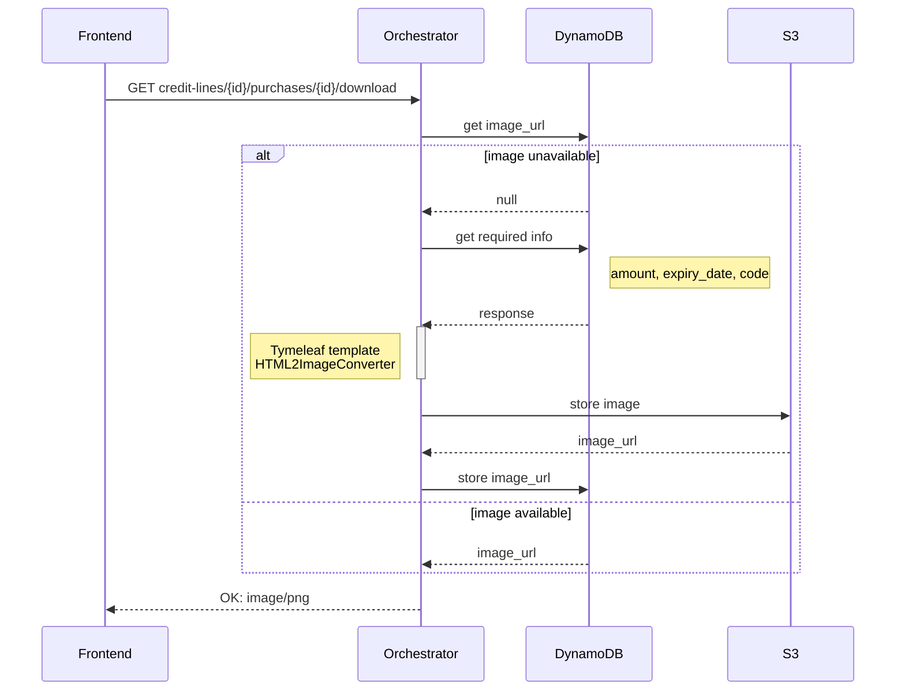

# 1290: Código de compra - Descargar código generado
> Generated on the controller through a service. 
> Access to the database is needed to get the required info. 
> Image may be stored in an object cache or S3 with an expiration time to reduce image generation time.

## Activity
Required info:
- `code` : TBD where stored in SBOLF-591 y SBOLF-1288
- `expiry_date` : TBD where stored in SBOLF-591 y SBOLF-1288
- `amount` : TBD where stored in SBOLF-591 y SBOLF-1288

### 1st stage: Generate on controller

### 2nd stage: Generate on controller and store on cache


> We would need provisions to delete image once the code expires 
## Endpoints
Gets active code for specific purchase

```
REQUEST
GET credit-lines/{id}/purchases/{id}/download

RESPONSES
200 - PNG image with all required info
400 - Bad request
403 - Forbidden
404 - Not Found
```

## ER Diagram
In case we want to store the generated image in S3, we could update the schema as to include `image_url`

## Questions
- se require guardar la imagen en alguna base de datos de objetos e.g. S3 o se puede generar cada vez que se solicite?
- se va a generar en el backend (podría guardarse) o en el frontend (más factible por la reutilización de estilos y diseños que posiblemente se puedan transformar de HTML a imagen)? 