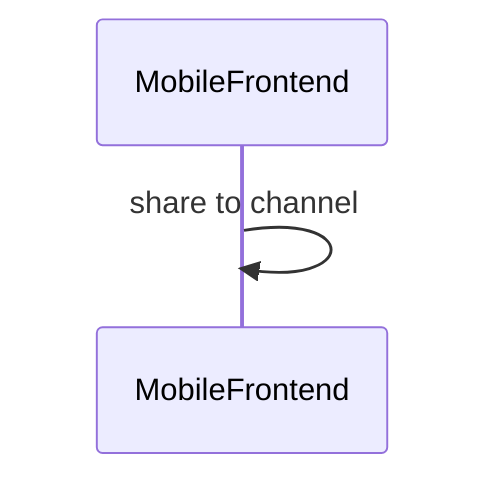

# 1291: Código de compra - Compartir código generado
A mi parecer, esta historia es exclusivamente Frontend pues no creo que haya necesidad de registrar información en la base de datos sobre si se comparte o no el código. Por lo mismo no hay endpoints involucrados más allá del de descargar imagen que está definido en SBOLF-1290 y tampoco habría cambios en la base de datos. Este sería el sequence diagram propuesto para una funcionalidad que debe ser nativa en las aplicaciones mobiles. El canal por el que se comparta es posible que el mismo teléfono lo filtre según las aplicaciones instaladas y su capacidad para compartir imágenes. 

> **NOTA:** La vista de desktop tiene descargar y compartir pero en desktop no hay diferencia entre descargar y compartir, en desktop la opción de compartir no debe estar habilitada.

## Activity

## Endpoints
> N/A

## ER Diagram
> N/A

## Questions
- No se especifican los canales a través de los cuales se compartirá el código
- El link de compartir de cada canal será determinado en el frontend o en backend?
- No se especifica si se requiere guardar información en la base de datos sobre lo que se comparte (e.g. compartido en whatsapp el día X, descargado el día X en mobil con ip, etc)