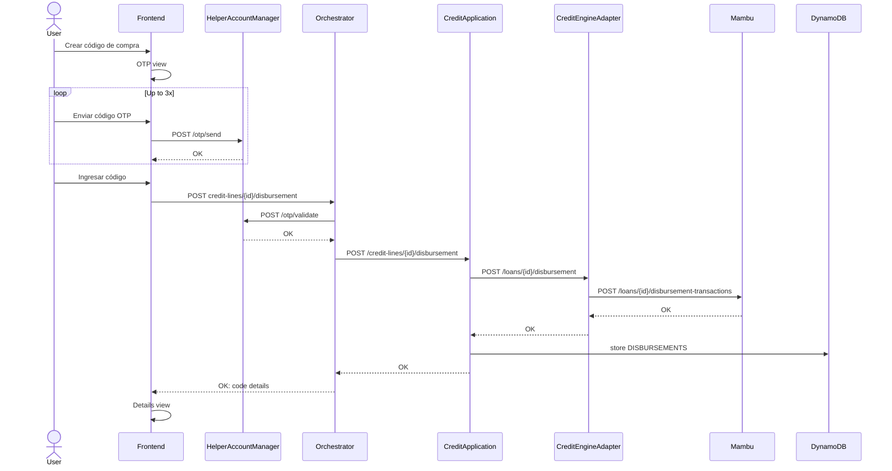

# 591: Crear código de compra - Mostrar detalle de código 

## Activity


## Endpoints
### Orchestrator
#### Crear código de compra [NEW]

```
REQUEST
POST credit-lines/{creditLineId}/disbursement
{
    "amount" : int // in cents
    "otp" : int
}

RESPONSES
201:
{
    "code" : string // el id/folio/codigo de compra
    "credit_line_id" : string
    "amount" : int // to display to the user
    "expiration_date" : date // to display to the user
    "state" : enum (**GENERADO**|USADO|VENCIDO)
}

400 - Bad request
403 - Forbidden
404 - Not Found
```

### CreditApplication

#### Crear código de compra [NEW]

```
REQUEST
POST credit-lines/{creditLineId}/disbursement
{
    "amount" : int // in cents
}

RESPONSES
201:
{
    "code" : string // el id/folio/codigo de compra
    "credit_line_id" : string
    "amount" : int // to display to the user
    "expiration_date" : date // to display to the user
    "state" : enum (**GENERADO**|USADO|VENCIDO)
    "created_at" : timestamp,
}

400 - Bad request
403 - Forbidden
404 - Not Found
```

### CreditEngineAdapter
#### Make disbursment [NEW]
Este endpoint se comunica con el endpoint `/loans/{id}/disbursement-transactions` de mambu (make a disbursment).

```
REQUEST
POST loans/{loanAccountId}/disbursement
{
    "amount" : int // in cents
}

RESPONSES
201:
{
    "code" : string // el id/folio/codigo de compra
    "credit_line_id" : string
    "amount" : int // to display to the user
    "expiration_date" : date // to display to the user
    "state" : enum (**GENERADO**|USADO|VENCIDO)
}

400 - Bad request
403 - Forbidden
404 - Not Found
```

##### Mambu Mappings
> TODO: review mappings based on selected mambu endpoint

CreditEngineAdapter | Mambu
-- | --
code | encodeKey
credit_line_id | loanAccountId
amount | amount
expiration_date | ?
state | ?

## Entity Relations
> TODO: To define once the endpoints are accepted and the persistable properties defined

## Questions
- Hay user story para expirar los códigos generados? Se puede usar redis y guardar el id de redis en la base de datos en vez o además del código
- no se menciona el base64 encoding en la descripción de la story, es con base64 que debe proporcionar el código de compra el endpoint que lo genere?
- de que está compuesto el código de compra? Se menciona el encodeKey de Mambu.. ¿ “encodeKey” == “código de compra” o el encodeKey es una parte del código de compra?
- que es lo que encodea el código QR? el “código de compra” como texto o una URL por ejemplo que valide el código de compra?
- Se pueden crear varios codigos de compra que esten activos al mismo tiempo?
- Cuales son los terminos de la linea de credito y codigo de compra en ingles y a que corresponden en mambu