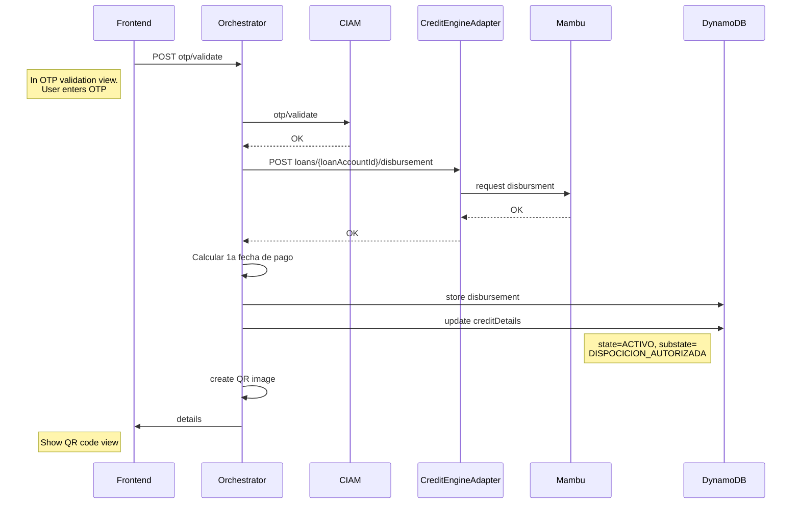
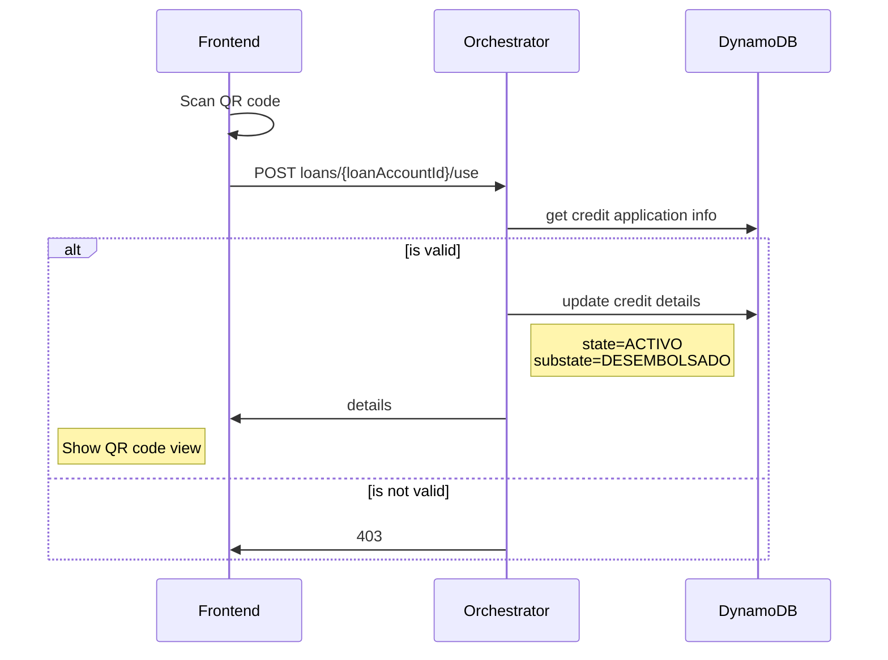
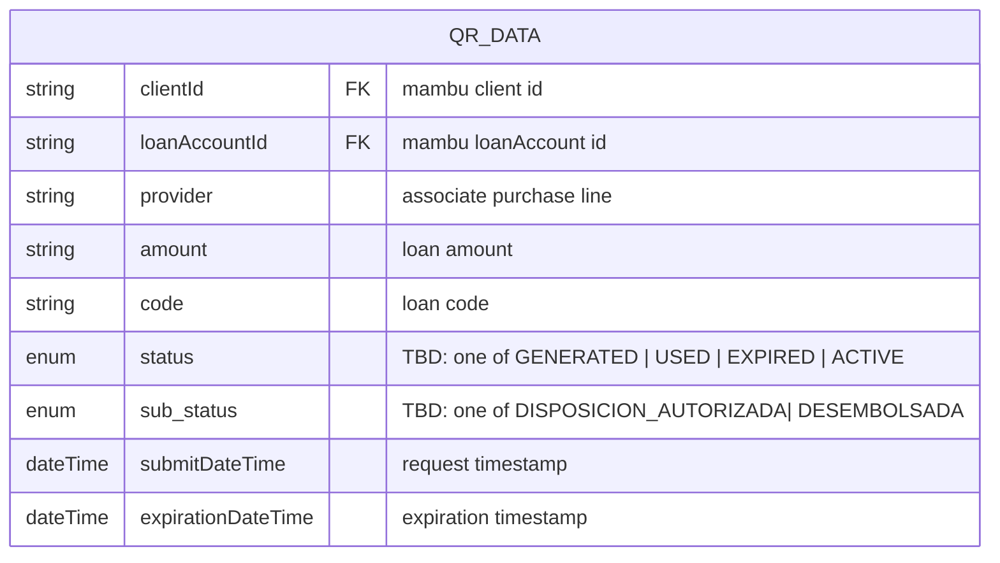

# 1288: Crear código de compra - Generar QR

## Activity

### Create QR code


### Scan QR code


## Endpoints
### ~~Ver detalles de código de compra~~
```
REQUEST
GET credit-line/{id}/purchase/{id}

RESPONSES
200:
{ 
    "code" : string // el id/folio/codigo de compra
    "credit_id" : string
    "amount" : int // to display to the user
    "expiration_date" : date // to display to the user
    "state" : enum (**GENERADO**|USADO|VENCIDO)
    "created_at" : timestamp,
    "updated_at" : timestamp,
}
400 - Bad request
403 - Forbidden
404 - Not Found
```
### Validar código de compra
```
REQUEST
GET GET credit-line/{id}/purchase/{id}/valid

RESPONSES
200:
{
    "clientId" : string
    "provider" : string
    "amount" : int 
    "timestamp" : date 
    
    // suggested
    "status" : enum (**GENERADO**|USADO|VENCIDO) // to check if not used or expired
    "expiration_date" : date // check expiration date
}
400 - Bad request
403 - Forbidden
404 - Not Found
``````

## ER Diagram


## Questions
- Definir si el código QR se genera en el front end o si la guardamos en la based de dato en base64/redis, o en S3
- Como se va a leer el código QR? Cuando se lea que es lo que debe haber tras el QR code? el código como texto, una url, etc?


